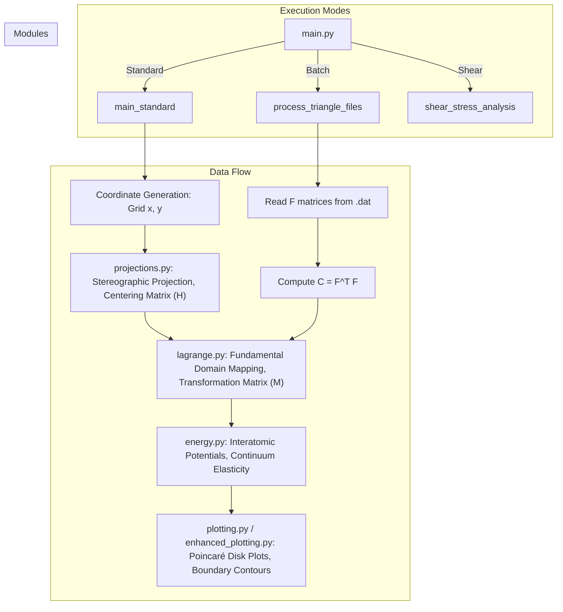

# Poincaré Disk Analysis: Codebase Map

This document provides a technical overview and logic map of the Poincaré disk analysis toolkit.

## System Architecture

The project is structured into a main execution script (`main.py`) and a core library (`src/`) that handles mathematical transformations and physics calculations.

### Logic Flow Diagram

## Component Breakdowns

### 1. Projections (`src/projections.py`)
Responsible for mapping points on the disk $(x, y)$ to metric tensors $C_{ij}$.
- **Centering**: Uses a matrix $H$ (optionally for triangular lattices) to shift the reference metric.
- **Stereographic Formulas**: Implements standard and centered projection math.
- **Inverse Projection**: Allows recovering disk coordinates from known metrics.

### 2. Lagrange Reduction (`src/lagrange.py`)
This is a critical geometric step that maps any metric tensor into a "Fundamental Domain".
- **Conditions**:
    - $C_{12} \geq 0$
    - $C_{22} \geq C_{11}$
    - $2C_{12} \leq C_{11}$
- **Transformation Matrix ($M$)**: Tracks the basis changes required to reach the reduced state. This matrix is essential for correct stress transformations.

### 3. Energy & Stress (`src/energy.py`)
Calculates physical quantities from the (reduced) metric tensors.
- **Interatomic Potentials**: Sums energy over neighbors (square or triangular lattice configurations).
- **Stress Tensors**: Computes Cauchy stress using either Lagrangian (from $C$) or Eulerian (from $B^{-1}$) formulations.
- **Continuum Energy**: A high-level implementation translated from Mathematica for comparing atomistic results with continuum theory.

### 4. Visualization (`src/plotting.py` & `src/enhanced_plotting.py`)
Creates the final maps.
- **Scatter Mode**: Can overlay experimental or simulation data (from $F$ matrices) onto the theoretical background.

### 5. Stability Boundary Filtering
The "original" stability boundary is filtered to ensure visual clarity and consistency with the fundamental domain.
- **Filtering Logic**: Only points satisfying the reduction condition $2|C_{12}| \leq \min(C_{11}, C_{22})$ are displayed.
- **Implementation Locations**:
    - **`src/enhanced_plotting.py`**: Applied in `poincare_plot_energy_with_fundamental_domains`. Includes segment selection (keeping the longest) and interpolation.
    - **`src/plotting.py`**: Applied in `poincare_plot_energy_with_f_matrices` (batch mode). Implementation mirrors the logic in `enhanced_plotting.py`.
    - **Note**: `poincare_plot_energy_with_precise_boundaries` (in `plotting.py`) currently plots the full data without filtering.

## Data Processing Pipeline

1.  **Input**: Either a spatial grid $(x, y)$ or a set of deformation gradients $F$.
2.  **Metric Calculation**: $C = F^T F$ (Lagrangian metric).
3.  **Transformation**: Centering is applied if requested.
4.  **Reduction**: Lagrange algorithm iterates until the metric is in the fundamental domain.
5.  **Physics**: Energy/Stress is calculated for the point.
6.  **Output**: A 2D color map or scatter plot in `figures/`.

---
> [!NOTE]
> The code is designed to handle both atomistic simulations (summing pairwise potentials) and continuum mechanics (using macroscopic invariants).
